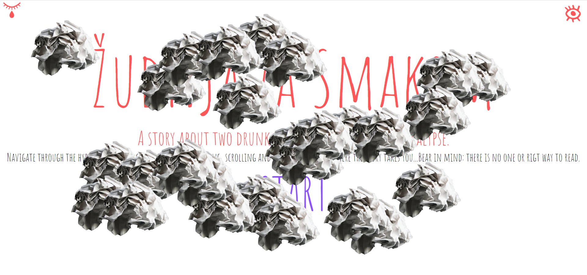
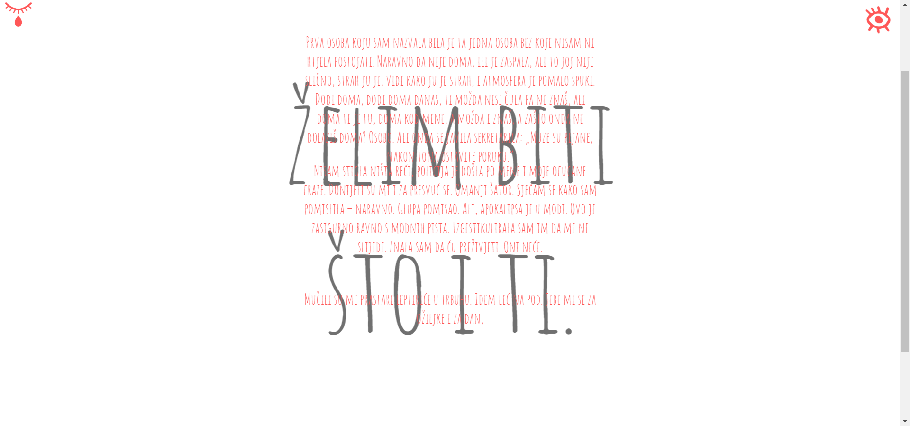
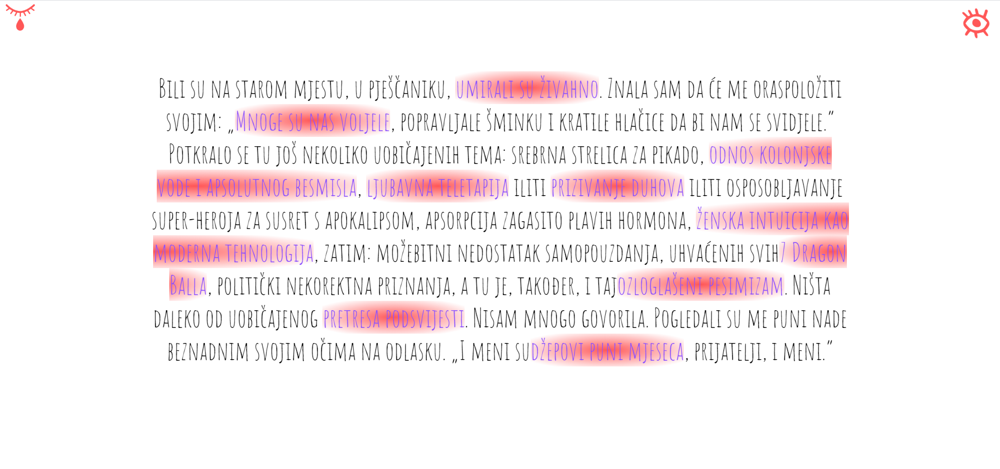
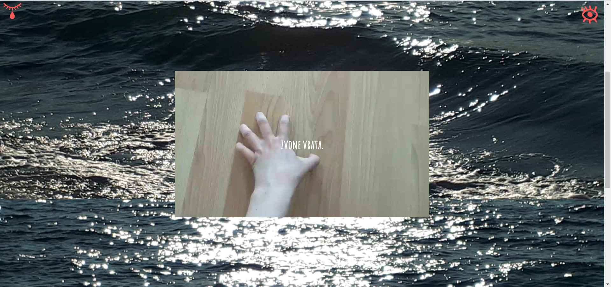
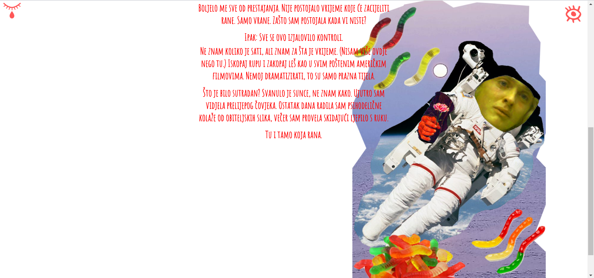
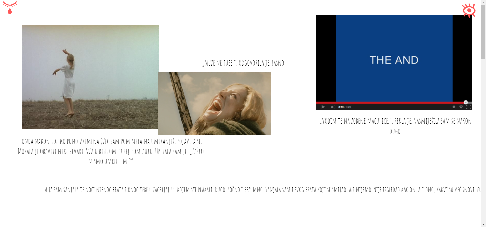
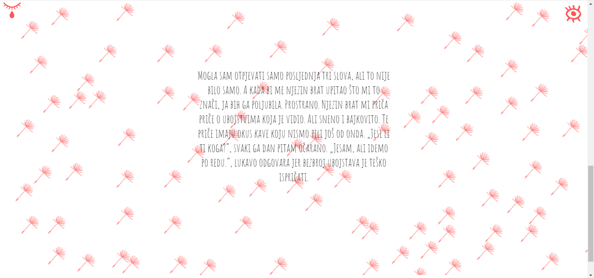
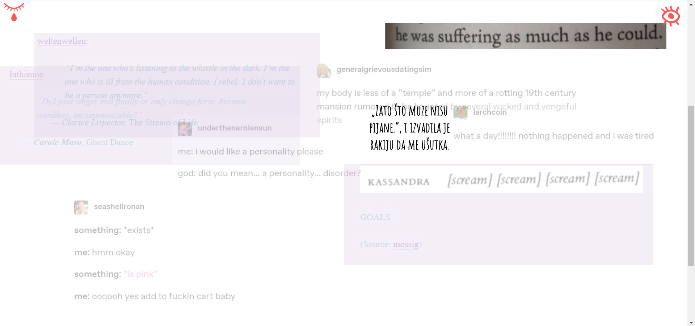
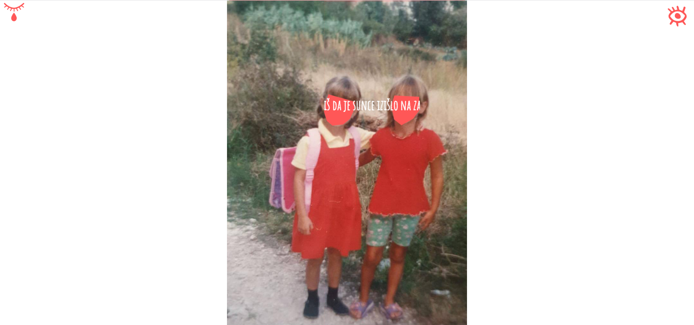

# Scrollytelling

Interactive storytelling triggered by user's scrolling, clicking and hovering.

## Description

With this project I wanted to learn in which way can code give extra layers of meaning to the text.

The users are invited to explore the story with no one or right way to read.

They can jump through parts of the story with steppers that slide in if they click on the icon in the left corner or upon reaching the end of the page.

On various occasions story leads them outside of itself descovering the potential of hypertext.

With different animations every part of the story creates different atmospheres and text finds itself in different roles.

## Stack

-   React
-   Framer Motion

## Explore the story on your own

...

## Future Features

-   English translation
-   Mobile version
-   Instruction manual
